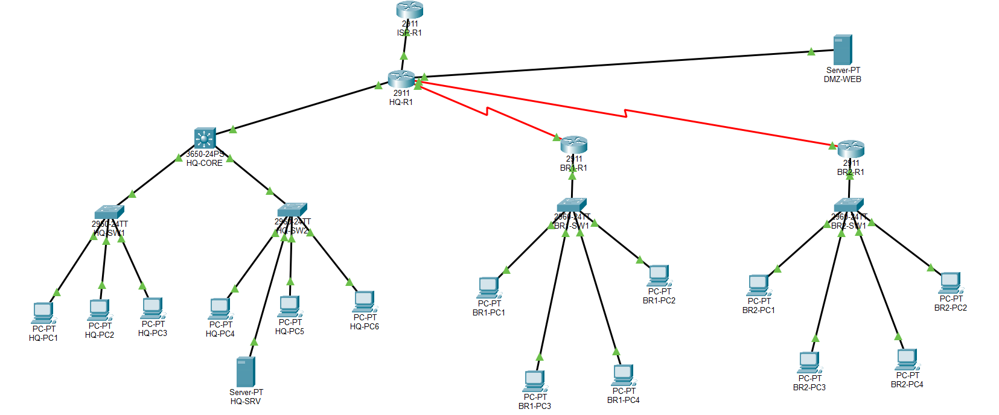
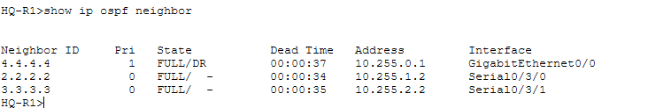

# Secure Multi-Branch Enterprise Network

A secure multi-branch enterprise network designed and implemented in Cisco Packet Tracer, focusing on network segmentation, dynamic routing, secure management, access control, NAT/PAT, and DMZ architecture.

## 📌 Project Overview

This project simulates an enterprise organization with a headquarters, two branch offices, and an ISP/Internet environment.

The network was designed with a security-first approach using VLAN segmentation, OSPF dynamic routing, ACLs, restricted SSH management, NAT/PAT, and a dedicated DMZ for public-facing services.

## 🏗️ Network Architecture



The network consists of:

- Headquarters (HQ)
- Branch 1
- Branch 2
- ISP/Internet network
- Dedicated DMZ
- Multiple departmental VLANs
- Centralized routing and security controls

## 🛠️ Technologies & Concepts

- Cisco Packet Tracer
- VLANs
- 802.1Q Trunking
- Inter-VLAN Routing
- OSPF
- IPv4 Subnetting
- Access Control Lists (ACLs)
- NAT/PAT
- DMZ
- SSH
- VTY Access Control
- Network Segmentation
- Network Hardening

## 🔐 Security Features

### VLAN Segmentation

Separate VLANs were created for different departments and network functions.

### Guest Network Isolation

The Guest VLAN is prevented from accessing internal enterprise networks while still being allowed to access the Internet.

### Branch User/Admin Isolation

Branch user networks are prevented from directly accessing their respective administrative networks.

### Secure Management

Network devices are managed using SSH instead of Telnet.

SSH access is further restricted using VTY access classes so that only authorized management networks can access network infrastructure.

### DMZ

A dedicated DMZ is used for public-facing services, separating them from trusted internal networks.

### Internet ACL

The Internet-facing interface uses an ACL to restrict unsolicited inbound traffic while allowing required public services.

### Security Hardening

Additional hardening includes:

- Restricted management access
- Security warning banners
- Unused-port shutdown
- VLAN-based management
- Access-control policies

## 🌐 Routing

OSPF is used as the dynamic routing protocol between the enterprise routers.

OSPF provides connectivity between:

- Headquarters
- Branch 1
- Branch 2
- ISP/Internet edge



## 🔄 NAT/PAT

NAT/PAT is configured on the enterprise Internet edge to allow private internal networks to communicate with the simulated Internet using the public address space.

```text
Improve README documentation and add project evidence
## 🖥️ DMZ Verification

The public HTTP service was tested from the simulated Internet using:

```text
telnet 203.0.113.2 80
