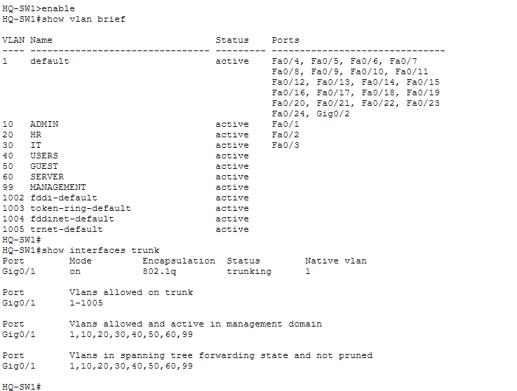
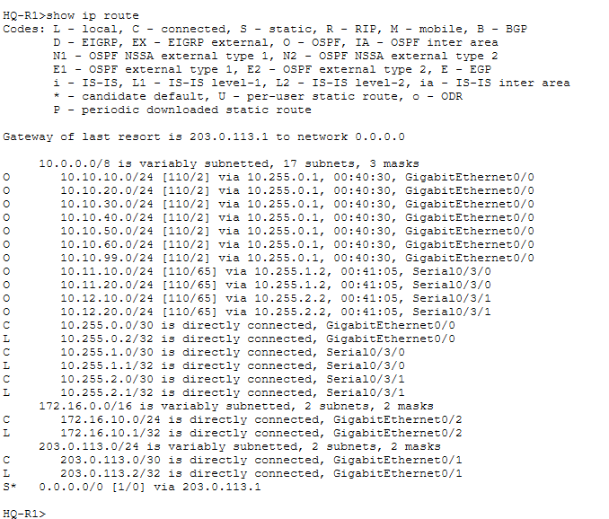
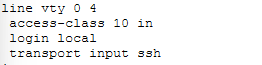
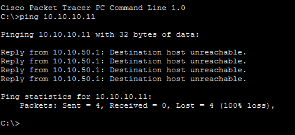
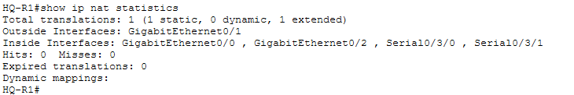
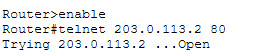

# 🔐 Secure Multi-Branch Enterprise Network

A secure multi-branch enterprise network designed and implemented using **Cisco Packet Tracer**, focusing on enterprise networking, network segmentation, dynamic routing, access control, secure management, NAT/PAT, and DMZ architecture.

---

## 📌 Project Overview

This project simulates a realistic enterprise environment consisting of:

- 🏢 Headquarters (HQ)
- 🏢 Branch 1
- 🏢 Branch 2
- 🌐 ISP / Internet network
- 🔐 Management networks
- 🖥️ Departmental VLANs
- 🌍 DMZ for public-facing services

The network was designed with a **security-first approach**, combining network segmentation, dynamic routing, access-control policies, secure device management, NAT/PAT, and controlled Internet access.

---

# 🏗️ Network Architecture


The topology includes:

- Headquarters network
- Two branch offices
- Multiple VLANs
- Layer 3 routing
- OSPF-enabled routers
- Management networks
- ISP connectivity
- DMZ
- End-user devices

---

# 📋 IP Addressing Scheme

The enterprise network uses structured IPv4 addressing to separate departments, branches, management traffic, servers, DMZ services, and WAN links.

## 🏢 HQ VLAN Addressing

| VLAN | Name | Network | Subnet Mask | Default Gateway |
|---:|---|---|---|---|
| 10 | ADMIN | `10.10.10.0/24` | `255.255.255.0` | `10.10.10.1` |
| 20 | HR | `10.10.20.0/24` | `255.255.255.0` | `10.10.20.1` |
| 30 | IT | `10.10.30.0/24` | `255.255.255.0` | `10.10.30.1` |
| 40 | USERS | `10.10.40.0/24` | `255.255.255.0` | `10.10.40.1` |
| 50 | GUEST | `10.10.50.0/24` | `255.255.255.0` | `10.10.50.1` |
| 60 | SERVER | `10.10.60.0/24` | `255.255.255.0` | `10.10.60.1` |
| 99 | MANAGEMENT | `10.10.99.0/24` | `255.255.255.0` | `10.10.99.1` |

---

## 💻 HQ End Devices

| Device | VLAN | IP Address | Subnet Mask | Default Gateway |
|---|---:|---|---|---|
| HQ-PC1 | 10 ADMIN | `10.10.10.11` | `255.255.255.0` | `10.10.10.1` |
| HQ-PC2 | 20 HR | `10.10.20.11` | `255.255.255.0` | `10.10.20.1` |
| HQ-PC3 | 30 IT | `10.10.30.11` | `255.255.255.0` | `10.10.30.1` |
| HQ-PC4 | 40 USERS | `10.10.40.11` | `255.255.255.0` | `10.10.40.1` |
| HQ-PC5 | 50 GUEST | `10.10.50.11` | `255.255.255.0` | `10.10.50.1` |
| HQ-PC6 | 10 ADMIN | `10.10.10.12` | `255.255.255.0` | `10.10.10.1` |
| HQ-SRV | 60 SERVER | `10.10.60.10` | `255.255.255.0` | `10.10.60.1` |

---

## 🏢 HQ Core & Router Addressing

| Device | Interface | IP Address | Subnet Mask | Purpose |
|---|---|---|---|---|
| HQ-CORE | G1/0/1 | `10.255.0.1` | `255.255.255.252` | HQ Core ↔ HQ-R1 |
| HQ-R1 | G0/0 | `10.255.0.2` | `255.255.255.252` | HQ Core connection |
| HQ-R1 | G0/1 | `203.0.113.2` | `255.255.255.252` | Internet-facing interface |
| HQ-R1 | G0/2 | `172.16.10.1` | `255.255.255.0` | DMZ gateway |
| HQ-R1 | S0/3/0 | `10.255.1.1` | `255.255.255.252` | HQ ↔ Branch 1 |
| HQ-R1 | S0/3/1 | `10.255.2.1` | `255.255.255.252` | HQ ↔ Branch 2 |

---

## 🏢 Branch 1 VLAN Addressing

| VLAN | Name | Network | Subnet Mask | Default Gateway |
|---:|---|---|---|---|
| 110 | BR1-USERS | `10.11.10.0/24` | `255.255.255.0` | `10.11.10.1` |
| 120 | BR1-ADMIN | `10.11.20.0/24` | `255.255.255.0` | `10.11.20.1` |

### Branch 1 Router

| Device | Interface | VLAN | IP Address |
|---|---|---:|---|
| BR1-R1 | G0/0.110 | 110 | `10.11.10.1` |
| BR1-R1 | G0/0.120 | 120 | `10.11.20.1` |
| BR1-R1 | S0/3/0 | WAN | `10.255.1.2` |

### Branch 1 End Devices

| Device | VLAN | IP Address | Subnet Mask | Default Gateway |
|---|---:|---|---|---|
| BR1-PC1 | 110 USERS | `10.11.10.11` | `255.255.255.0` | `10.11.10.1` |
| BR1-PC2 | 110 USERS | `10.11.10.12` | `255.255.255.0` | `10.11.10.1` |
| BR1-PC3 | 120 ADMIN | `10.11.20.11` | `255.255.255.0` | `10.11.20.1` |
| BR1-PC4 | 120 ADMIN | `10.11.20.12` | `255.255.255.0` | `10.11.20.1` |

---

## 🏢 Branch 2 VLAN Addressing

| VLAN | Name | Network | Subnet Mask | Default Gateway |
|---:|---|---|---|---|
| 210 | BR2-USERS | `10.12.10.0/24` | `255.255.255.0` | `10.12.10.1` |
| 220 | BR2-ADMIN | `10.12.20.0/24` | `255.255.255.0` | `10.12.20.1` |

### Branch 2 Router

| Device | Interface | VLAN | IP Address |
|---|---|---:|---|
| BR2-R1 | G0/0.210 | 210 | `10.12.10.1` |
| BR2-R1 | G0/0.220 | 220 | `10.12.20.1` |
| BR2-R1 | S0/3/0 | WAN | `10.255.2.2` |

### Branch 2 End Devices

| Device | VLAN | IP Address | Subnet Mask | Default Gateway |
|---|---:|---|---|---|
| BR2-PC1 | 210 USERS | `10.12.10.11` | `255.255.255.0` | `10.12.10.1` |
| BR2-PC2 | 210 USERS | `10.12.10.12` | `255.255.255.0` | `10.12.10.1` |
| BR2-PC3 | 220 ADMIN | `10.12.20.11` | `255.255.255.0` | `10.12.20.1` |
| BR2-PC4 | 220 ADMIN | `10.12.20.12` | `255.255.255.0` | `10.12.20.1` |

---

## 🌍 DMZ Addressing

The DMZ is isolated into its own network:

```text
172.16.10.0/24
```

| Device | Interface | IP Address | Subnet Mask | Purpose |
|---|---|---|---|---|
| HQ-R1 | G0/2 | `172.16.10.1` | `255.255.255.0` | DMZ Gateway |
| DMZ-WEB | NIC | `172.16.10.10` | `255.255.255.0` | Public Web Server |

The DMZ provides a separate security zone for public-facing services without placing them directly inside the trusted internal networks.

---

## 🌐 ISP / Internet Addressing

| Device | Interface | IP Address | Subnet Mask | Purpose |
|---|---|---|---|---|
| ISP-R1 | G0/0 | `203.0.113.1` | `255.255.255.252` | ISP ↔ HQ-R1 |
| HQ-R1 | G0/1 | `203.0.113.2` | `255.255.255.252` | Internet-facing interface |
| ISP-R1 | Loopback0 | `198.51.100.1` | `255.255.255.255` | Simulated Internet |

---

## 🔗 WAN Addressing

### HQ ↔ Branch 1

Network:

```text
10.255.1.0/30
```

| Device | Interface | IP Address |
|---|---|---|
| HQ-R1 | S0/3/0 | `10.255.1.1` |
| BR1-R1 | S0/3/0 | `10.255.1.2` |

### HQ ↔ Branch 2

Network:

```text
10.255.2.0/30
```

| Device | Interface | IP Address |
|---|---|---|
| HQ-R1 | S0/3/1 | `10.255.2.1` |
| BR2-R1 | S0/3/0 | `10.255.2.2` |

---

## 📊 Complete Network Summary

| Network | Purpose |
|---|---|
| `10.10.10.0/24` | HQ ADMIN |
| `10.10.20.0/24` | HQ HR |
| `10.10.30.0/24` | HQ IT |
| `10.10.40.0/24` | HQ USERS |
| `10.10.50.0/24` | HQ GUEST |
| `10.10.60.0/24` | HQ SERVER |
| `10.10.99.0/24` | HQ MANAGEMENT |
| `10.11.10.0/24` | Branch 1 USERS |
| `10.11.20.0/24` | Branch 1 ADMIN |
| `10.12.10.0/24` | Branch 2 USERS |
| `10.12.20.0/24` | Branch 2 ADMIN |
| `172.16.10.0/24` | DMZ |
| `10.255.0.0/30` | HQ-CORE ↔ HQ-R1 |
| `10.255.1.0/30` | HQ ↔ Branch 1 |
| `10.255.2.0/30` | HQ ↔ Branch 2 |
| `203.0.113.0/30` | HQ ↔ ISP |
| `198.51.100.1/32` | Simulated Internet |

---

## 🧭 Addressing Design

The addressing scheme separates the enterprise into multiple security and routing domains:

- **Departmental VLANs** isolate HQ departments.
- **Guest VLAN 50** separates guest users from trusted internal networks.
- **Management VLAN 99** provides a dedicated management network.
- **Server VLAN 60** separates internal servers from user networks.
- **Branch VLANs** provide independent user and administrative networks.
- **DMZ `172.16.10.0/24`** isolates public-facing services.
- **/30 WAN networks** provide point-to-point connectivity between routers.
- **203.0.113.0/30** provides the simulated Internet connection between HQ-R1 and ISP-R1.

This addressing structure supports the project's routing, ACL, NAT, SSH, and DMZ security policies.

# 🛠️ Technologies & Concepts

| Technology / Concept | Purpose |
|---|---|
| Cisco Packet Tracer | Network simulation |
| VLANs | Network segmentation |
| 802.1Q Trunking | VLAN transport |
| Inter-VLAN Routing | Communication between VLANs |
| OSPF | Dynamic routing |
| IPv4 Subnetting | Network addressing |
| ACLs | Traffic filtering |
| NAT/PAT | Internet connectivity |
| DMZ | Public-service isolation |
| SSH | Secure device management |
| VTY Access Control | Restricting management access |
| Network Hardening | Reducing attack surface |

---

# 🔀 VLAN & Switching

The network uses VLAN-based segmentation to separate different departments and network functions.

Example VLAN structure:

| VLAN | Purpose |
|---:|---|
| 10 | ADMIN |
| 20 | HR |
| 30 | IT |
| 40 | USERS |
| 50 | GUEST |
| 60 | SERVER |
| 99 | MANAGEMENT |

802.1Q trunking is used to carry multiple VLANs between network devices.

## VLAN & Trunk Verification



Verified using:

```text
show vlan brief
show interfaces trunk
```

---

# 🌐 Dynamic Routing with OSPF

OSPF was implemented as the dynamic routing protocol between enterprise routers.

It provides dynamic route exchange between:

- Headquarters
- Branch 1
- Branch 2
- ISP / Internet edge

## OSPF Neighbor Verification


Verified using:

```text
show ip ospf neighbor
```

## Routing Table Verification



Verified using:

```text
show ip route
```

OSPF-learned routes are identified by the `O` route code.

---

# 🔐 Network Security

Security controls were implemented at multiple layers of the network.

The main security objectives were:

- Network segmentation
- Guest isolation
- Restricted infrastructure management
- Controlled inter-network communication
- Secure remote administration
- Internet-facing traffic filtering
- DMZ isolation

---

# 🔑 Secure SSH Management

Network devices are managed using **SSH instead of Telnet**.

VTY access restrictions were configured so that only authorized management networks can access infrastructure devices.



Important verification commands:

```text
show ip ssh
show running-config | section line vty
```

---

# 🛡️ ACL-Based Network Security

Access Control Lists were used to enforce network security policies.

Security policies include:

- Guest network isolation
- Branch user/admin isolation
- Restricted management access
- Internet-facing traffic filtering

## ACL Verification

```text
show access-lists
```

## ACL Enforcement Test

Rather than only configuring an ACL, the policy was tested using an unauthorized traffic attempt.



This demonstrates that traffic violating the defined security policy is blocked.

---

# 🔄 NAT / PAT

NAT/PAT was configured at the enterprise Internet edge.

This allows private internal networks to communicate with the simulated Internet through public addressing.

## NAT Verification



Important commands:

```text
show ip nat statistics
show ip nat translations
```

---

# 🌍 DMZ Architecture

A dedicated **DMZ** was implemented for public-facing services.

The DMZ prevents publicly accessible services from being placed directly inside trusted internal networks.

```text
Internet
   │
   ▼
HQ-R1
   │
   ▼
 DMZ
   │
   ▼
Public Web Server
```

## DMZ HTTP Connectivity Test

The public HTTP service was tested from the simulated Internet using:

```text
telnet 203.0.113.2 80
```



A successful connection confirmed that the public-facing HTTP service was reachable from the simulated Internet.

---

# 🧪 Network & Security Validation

The completed network was tested for:

### Switching

- VLAN configuration
- Trunk configuration
- VLAN propagation

### Routing

- OSPF neighbor relationships
- OSPF-learned routes
- Routing table correctness

### Security

- Guest network isolation
- Branch user/admin isolation
- Unauthorized SSH access rejection
- Restricted management access
- ACL enforcement

### Internet & DMZ

- NAT/PAT operation
- Public HTTP accessibility
- DMZ connectivity

### Connectivity

- End-to-end connectivity between permitted networks
- HQ ↔ Branch connectivity
- Internet connectivity

---

# 💻 Important Cisco IOS Commands

This section documents the major commands used throughout the project for **configuration, verification, troubleshooting, and security testing**.

---

## 1. Basic Device & Configuration Commands

Enter privileged EXEC mode:

```text
enable
```

Enter global configuration mode:

```text
configure terminal
```

Exit configuration mode:

```text
end
```

Exit the current configuration section:

```text
exit
```

Display the running configuration:

```text
show running-config
```

Display the startup configuration:

```text
show startup-config
```

Save the running configuration:

```text
copy running-config startup-config
```

Alternative:

```text
write memory
```

Display device information:

```text
show version
```

Display available interfaces:

```text
show ip interface brief
```

---

# 2. VLAN Commands

Create a VLAN:

```text
vlan 10
name ADMIN
```

Example:

```text
vlan 20
name HR
```

Assign an access port to a VLAN:

```text
interface fastethernet0/1
switchport mode access
switchport access vlan 10
```

Verify VLANs:

```text
show vlan brief
```

Verify a specific interface:

```text
show interfaces fastethernet0/1 switchport
```

---

# 3. Trunking Commands

Configure an interface as an 802.1Q trunk:

```text
interface gigabitethernet0/1
switchport mode trunk
```

Specify allowed VLANs:

```text
switchport trunk allowed vlan 10,20,30,40,50,60,99
```

Verify trunk interfaces:

```text
show interfaces trunk
```

Verify interface configuration:

```text
show running-config interface gigabitethernet0/1
```

---

# 4. Interface & IP Configuration

Enter an interface:

```text
interface gigabitethernet0/1
```

Assign an IPv4 address:

```text
ip address <IP-ADDRESS> <SUBNET-MASK>
```

Enable the interface:

```text
no shutdown
```

Disable an interface:

```text
shutdown
```

Verify interface status:

```text
show ip interface brief
```

Display detailed interface information:

```text
show interfaces
```

Display a specific interface configuration:

```text
show running-config interface gigabitethernet0/1
```

---

# 5. Inter-VLAN Routing

Configure a router subinterface:

```text
interface gigabitethernet0/0.10
encapsulation dot1Q 10
ip address <GATEWAY-IP> <SUBNET-MASK>
```

Repeat for each VLAN.

Verify subinterfaces:

```text
show ip interface brief
```

Verify the configuration:

```text
show running-config
```

---

# 6. OSPF Commands

Start OSPF:

```text
router ospf 1
```

Configure a router ID:

```text
router-id <ROUTER-ID>
```

Advertise a network:

```text
network <NETWORK> <WILDCARD-MASK> area 0
```

Example:

```text
network 10.11.20.0 0.0.0.255 area 0
```

Verify OSPF neighbors:

```text
show ip ospf neighbor
```

Verify OSPF configuration:

```text
show ip protocols
```

Display OSPF routes:

```text
show ip route ospf
```

Display the complete routing table:

```text
show ip route
```

Display OSPF process information:

```text
show ip ospf
```

---

# 7. Routing & Connectivity Commands

Display the routing table:

```text
show ip route
```

Test connectivity:

```text
ping <DESTINATION-IP>
```

Trace the path to a destination:

```text
traceroute <DESTINATION-IP>
```

Display ARP entries:

```text
show arp
```

Display the IP-to-MAC mapping:

```text
show ip arp
```

---

# 8. ACL Commands

Create a standard ACL:

```text
access-list 99 permit 10.10.99.0 0.0.0.255
```

Create an extended ACL:

```text
ip access-list extended GUEST-ACL
```

Deny traffic:

```text
deny ip <SOURCE> <WILDCARD> <DESTINATION> <WILDCARD>
```

Permit traffic:

```text
permit ip <SOURCE> <WILDCARD> any
```

Apply an ACL to an interface:

```text
interface <INTERFACE>
ip access-group <ACL-NUMBER> in
```

Verify ACLs:

```text
show access-lists
```

Display a specific ACL:

```text
show access-lists 101
```

The ACL hit counters can be used to determine whether traffic is matching a rule.

---

# 9. VTY / SSH Security Commands

Configure the VTY lines:

```text
line vty 0 4
```

Enable local authentication:

```text
login local
```

Allow SSH:

```text
transport input ssh
```

Restrict VTY access using an ACL:

```text
access-class 99 in
```

Create a local administrative user:

```text
username admin privilege 15 secret <PASSWORD>
```

Configure the domain name:

```text
ip domain-name <DOMAIN>
```

Generate RSA keys:

```text
crypto key generate rsa
```

Enable SSH version 2:

```text
ip ssh version 2
```

Verify SSH:

```text
show ip ssh
```

Verify VTY configuration:

```text
show running-config | section line vty
```

Test SSH from a client:

```text
ssh -l admin <DEVICE-IP>
```

---

# 10. NAT / PAT Commands

Verify NAT configuration:

```text
show ip nat statistics
```

Display active NAT translations:

```text
show ip nat translations
```

Clear dynamic NAT translations:

```text
clear ip nat translation *
```

Configure an inside interface:

```text
interface <INTERFACE>
ip nat inside
```

Configure an outside interface:

```text
interface <INTERFACE>
ip nat outside
```

PAT configuration typically uses an overload rule:

```text
ip nat inside source list <ACL-NUMBER> interface <OUTSIDE-INTERFACE> overload
```

---

# 11. DMZ / Public Service Testing

Test HTTP connectivity:

```text
telnet 203.0.113.2 80
```

A successful result:

```text
Open
```

indicates that the TCP connection to the public HTTP service was established.

Test basic IP connectivity:

```text
ping 203.0.113.2
```

---

# 12. Device Hardening Commands

Display current configuration:

```text
show running-config
```

Configure a login banner:

```text
banner motd #Unauthorized access prohibited#
```

Disable an unused interface:

```text
interface <INTERFACE>
shutdown
```

Verify disabled interfaces:

```text
show ip interface brief
```

---

# 13. Troubleshooting Commands

Check interface status:

```text
show ip interface brief
```

Check VLAN membership:

```text
show vlan brief
```

Check trunking:

```text
show interfaces trunk
```

Check routing:

```text
show ip route
```

Check OSPF neighbors:

```text
show ip ospf neighbor
```

Check ARP:

```text
show ip arp
```

Check ACLs:

```text
show access-lists
```

Check NAT:

```text
show ip nat translations
show ip nat statistics
```

Check SSH:

```text
show ip ssh
```

Check VTY configuration:

```text
show running-config | section line vty
```

Test connectivity:

```text
ping <DESTINATION-IP>
```

Trace a route:

```text
traceroute <DESTINATION-IP>
```

---

# 🔒 Security Design Summary

The security model can be summarized as:

```text
                INTERNET
                    │
                    ▼
              ┌───────────┐
              │   HQ-R1   │
              │ ACL + NAT │
              └─────┬─────┘
                    │
          ┌─────────┴─────────┐
          │                   │
          ▼                   ▼
        DMZ              Internal Network
          │                   │
    Public Services      VLAN Segmentation
                              │
                    ┌─────────┼─────────┐
                    │         │         │
                  Users      Admin     Guest
                    │         │         │
                    └─────────┴────┬────┘
                                   │
                              ACL Policies
```

The design follows the principle of **segmenting networks and restricting unnecessary communication**.

---

# 📂 Repository Structure

```text
secure-multi-branch-enterprise-network/
│
├── README.md
│
├── secure-multi-branch-enterprise-network.pkt
│
└── screenshots/
    │
    ├── topology.png
    ├── vlan-trunk.png
    ├── ospf-neighbor.png
    ├── routing-table.png
    ├── ssh-vty-security.png
    ├── acl-test-client.png
    ├── nat-dmz.png
    └── dmz-http-test.png
```

---

# 🎯 Learning Outcomes

Through this project, I gained practical experience with:

- Enterprise network design
- Cisco IOS configuration
- VLAN and subnet design
- 802.1Q trunking
- Inter-VLAN routing
- Dynamic routing using OSPF
- IPv4 addressing
- Access Control Lists
- Network segmentation
- Secure infrastructure management using SSH
- NAT/PAT
- DMZ architecture
- Network troubleshooting
- Security policy implementation
- Network security validation

---

# 🚀 Future Improvements

Potential future enhancements include:

- DHCP server integration
- Centralized Syslog logging
- SNMP-based network monitoring
- AAA authentication
- RADIUS/TACACS+ integration
- Switch port security
- IDS/IPS integration
- More granular firewall policies
- Redundant routing and gateway infrastructure
- Network monitoring dashboard

---

# 📄 Project File

The complete Cisco Packet Tracer project is available in:

```text
secure-multi-branch-enterprise-network.pkt
```

The project can be opened using **Cisco Packet Tracer**.

---

## 👨‍💻 Project Focus

**Networking • Cybersecurity • Network Security • Cisco • Enterprise Infrastructure**
