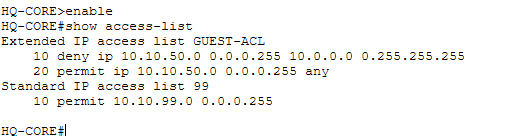

# 🔐 Secure Multi-Branch Enterprise Network

A secure multi-branch enterprise network designed and implemented using **Cisco Packet Tracer**, with a focus on enterprise networking, network segmentation, routing, access control, secure management, NAT/PAT, and DMZ architecture.

---

## 📌 Project Overview

This project simulates a realistic enterprise network consisting of:

- 🏢 Headquarters (HQ)
- 🏢 Branch 1
- 🏢 Branch 2
- 🌐 ISP / Internet network
- 🖥️ Internal departmental networks
- 🔐 Management networks
- 🌍 DMZ for public-facing services

The network was designed with a **security-first approach**, using VLAN segmentation, OSPF dynamic routing, ACLs, restricted SSH management, NAT/PAT, and a dedicated DMZ.

---

# 🏗️ Network Topology

The complete enterprise topology is shown below.


The topology includes:

- HQ routers and switches
- Branch routers and switches
- VLAN-based departmental networks
- Management VLANs
- Inter-router WAN links
- ISP connectivity
- DMZ
- End-user devices

---

# 🛠️ Technologies & Concepts

| Technology | Purpose |
|---|---|
| Cisco Packet Tracer | Network simulation |
| VLANs | Network segmentation |
| 802.1Q Trunking | VLAN transport between switches |
| Inter-VLAN Routing | Communication between VLANs |
| OSPF | Dynamic routing |
| IPv4 Subnetting | Network addressing |
| ACLs | Traffic filtering and access control |
| NAT/PAT | Internet connectivity |
| DMZ | Public-facing service isolation |
| SSH | Secure device management |
| VTY Access Control | Restricting management access |
| Network Hardening | Reducing attack surface |

---

# 🌐 OSPF Dynamic Routing

OSPF was configured to provide dynamic routing between the enterprise routers.

The routing design allows connectivity between:

- Headquarters
- Branch 1
- Branch 2
- ISP / Internet edge

## OSPF Neighbor Verification

OSPF neighbor relationships were verified using:

```text
show ip ospf neighbor
```

The following screenshot shows the OSPF neighbor relationships and their states.


---

# 🔐 Network Security & ACLs

Access Control Lists were implemented to control traffic between different network segments.

Security policies include:

- Guest network isolation
- Branch user/admin isolation
- Restricted management access
- Internet-facing traffic filtering
- Controlled access to internal networks

## ACL Verification

The configured ACLs were verified using:

```text
show access-lists
```

The following screenshot shows the configured security ACLs.



---

# 🔄 NAT / PAT

NAT/PAT was configured at the enterprise Internet edge to allow private internal networks to communicate with the simulated Internet using public addressing.

NAT was verified using:

```text
show ip nat statistics
show ip nat translations
```

## NAT Verification


---

# 🖥️ DMZ Architecture

A dedicated DMZ was implemented for public-facing services.

The DMZ separates publicly accessible services from trusted internal enterprise networks.

The Internet-facing HTTP service was tested from the simulated ISP network using:

```text
telnet 203.0.113.2 80
```

The connection successfully opened from **ISP-R1**, confirming that the public-facing HTTP service was reachable.

## DMZ HTTP Connectivity Test


---

# 🔒 Security Features

## VLAN Segmentation

Different departments and network functions are separated into dedicated VLANs.

This reduces unnecessary Layer 2 connectivity and provides a foundation for access-control policies.

## Guest Network Isolation

The Guest VLAN is prevented from accessing internal enterprise networks while still being permitted to reach the Internet.

## Branch User/Admin Isolation

User networks at Branch 1 and Branch 2 are prevented from directly accessing their respective administrative networks.

## Secure SSH Management

Network devices are managed using SSH instead of Telnet.

VTY access controls restrict SSH management access to authorized management networks.

For example:

```text
Management Network → Infrastructure SSH    ✅
User Network       → Infrastructure SSH    ❌
```

## DMZ Isolation

Public-facing services are placed in a dedicated DMZ instead of the trusted internal networks.

## Internet ACL

The Internet-facing router interface uses ACL-based filtering to restrict unsolicited inbound traffic while allowing required public services.

## Device Hardening

Additional security measures include:

- SSH-based management
- Management VLANs
- VTY access restrictions
- Security warning banners
- Unused-port shutdown
- ACL-based traffic filtering

---

# 🧪 Network & Security Testing

The completed network was systematically tested for:

### Connectivity

- End-to-end connectivity between permitted networks
- HQ ↔ Branch connectivity
- Internet connectivity

### Routing

- OSPF neighbor relationships
- OSPF-learned routes
- Routing table verification

### Security

- Guest network isolation
- Branch user/admin isolation
- Unauthorized SSH access rejection
- Management VLAN restrictions
- Internet ACL filtering

### NAT / DMZ

- NAT/PAT operation
- Public HTTP accessibility
- DMZ connectivity from the simulated Internet

---

# 📸 Project Evidence

The repository contains five key screenshots demonstrating the implementation and verification of the network.

### 1. Network Topology


### 2. OSPF Neighbor Verification


### 3. ACL Security Configuration


### 4. NAT / DMZ Configuration


### 5. DMZ HTTP Connectivity Test


---

# 📂 Repository Structure

```text
secure-multi-branch-enterprise-network/
│
├── README.md
│
├── secure-multi-branch-enterprise-network.pkt
│
└── screenshots/
    │
    ├── topology.png
    ├── ospf-neighbor.png
    ├── acl-security.png
    ├── nat-dmz.png
    └── dmz-http-test.png
```

---

# 🎯 Learning Outcomes

This project provided hands-on experience with:

- Enterprise network design
- Cisco IOS configuration
- VLAN and subnet design
- Inter-VLAN routing
- Dynamic routing using OSPF
- IPv4 addressing
- ACL-based network security
- Network segmentation
- Secure infrastructure management using SSH
- NAT/PAT
- DMZ architecture
- Network troubleshooting
- Security policy validation

---

# 🚀 Future Improvements

Potential future enhancements include:

- DHCP server integration
- Centralized Syslog logging
- SNMP-based network monitoring
- AAA authentication
- RADIUS/TACACS+ integration
- Switch port security
- IDS/IPS integration
- More granular firewall policies
- Redundant routing and gateway infrastructure
- Network monitoring dashboard

---

## 📄 Project File

The complete Cisco Packet Tracer project is available in:

```text
secure-multi-branch-enterprise-network.pkt
```

You can download the `.pkt` file from this repository and open it using **Cisco Packet Tracer**.
